<div align="center">


<br/>

[](./LICENSE)
[](https://github.com/ArioMoniri/cerebralink/actions/workflows/ci.yml)
[](#status-limitations--known-gaps)
[](https://www.python.org/)
[](https://nextjs.org/)
[](#standards--interoperability)

**A streaming, multi-agent clinical decision-support assistant.**

A clinical question is routed to a set of specialized agents that run in parallel.
A partial answer streams in seconds; a cited, trust-scored full answer follows.
EHR access is via a single pluggable adapter, so the system is FHIR R4 and
HL7 v2 compatible. PHI is de-identified before any reasoning model sees it.

[What it solves](#what-it-solves) ·
[Architecture](#agentic-architecture) ·
[Set up](#how-to-set-up) ·
[API](#api-contract) ·
[EHR integration](#ehr-integration) ·
[Standards](#standards--interoperability) ·
[Limitations](#status-limitations--known-gaps)

</div>

---

> [!WARNING]
> **Medical disclaimer.** CerebraLink is a clinical decision-support and research
> tool. It is **not** a medical device and **not** a substitute for professional
> medical judgment. Every output must be independently verified by a licensed
> clinician before any clinical use. See [`NOTICE`](./NOTICE).

> [!IMPORTANT]
> **Status: experimental (v0.x).** Single-maintainer research project. Not
> production-validated; no clinical trials or regulatory clearance. There is no
> automated test suite yet (CI runs build, import, and compose-config checks).
> See [Status, Limitations & Known Gaps](#status-limitations--known-gaps).

## Table of Contents

<table>
<tr>
<td valign="top">

**Get started**
- [What It Solves](#what-it-solves)
- [Screenshots](#screenshots)
- [How to Set Up](#how-to-set-up)
- [Configuration](#configuration)

</td>
<td valign="top">

**Under the hood**
- [Agentic Architecture](#agentic-architecture)
- [Clinical Reasoning Tree](#clinical-reasoning-tree)
- [Streaming Pipeline](#the-streaming-pipeline)
- [Trust Scoring](#trust--confidence-scoring)
- [Anatomy of a Query](#anatomy-of-a-query)
- [API Contract](#api-contract)

</td>
<td valign="top">

**Integrate & extend**
- [Data Sources](#data-sources--retrieval)
- [EHR Integration](#ehr-integration)
- [Standards & Interop](#standards--interoperability)
- [Project Structure](#project-structure)
- [Tech Stack](#tech-stack)

</td>
<td valign="top">

**Project**
- [Limitations](#status-limitations--known-gaps)
- [Security](#security)
- [Contributing](#contributing)
- [Roadmap](#roadmap)
- [License](#license)

</td>
</tr>
</table>

## What It Solves

Answering one clinical question often means cross-checking guidelines, drug
interactions, the patient's history, and local formularies across several
systems. CerebraLink does this in one place: you ask once and get a streamed,
cited, trust-scored answer, with the patient's own record folded in when an
identifier is provided.

| Problem | How CerebraLink handles it |
|---------|----------------------------|
| Guidelines, drug data, and patient history live in separate systems | A set of agents queries them in parallel and composes one answer |
| LLM medical answers are slow and unsourced | A partial answer streams in seconds; the full answer carries source-resolvable citations |
| Hard to gauge how much to trust an answer | A separate agent scores six axes (evidence, alignment, relevance, safety, completeness, recency) |
| Generic chatbots ignore the actual patient | Pluggable EHR adapter + RAG over reports, episodes, and monitoring data |
| Patient data must not leak to LLMs | Regex de-identification runs on ingest, before any reasoning model |
| Prescriptions need local brand names | ATC mapping plus per-country brand options with a searchable picker |

## Screenshots

The previews below are UI mockups (they render everywhere). Replace them with real
captures of your instance when convenient.

| Chat with Fast / Full / Highlights tabs | Trust scores & source references |
|:---:|:---:|
| 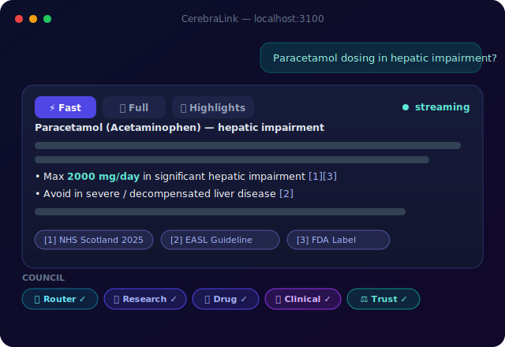 | 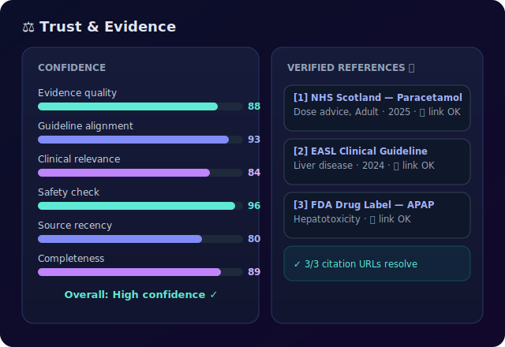 |
| **Prescription card with searchable brand picker** | **Knowledge graph & lab trends** |
| 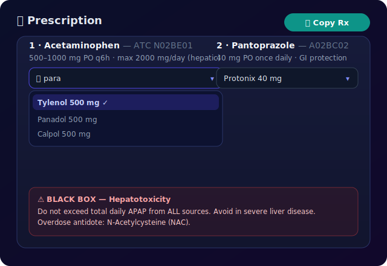 | 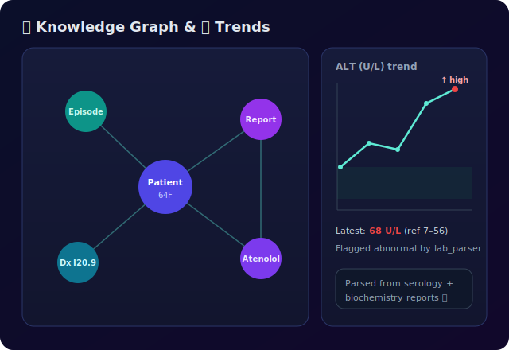 |

<details>
<summary>How to add real screenshots</summary>

```bash
docker compose up -d            # boot the stack
open http://localhost:3100      # ask, e.g. "paracetamol dosing in hepatic impairment"
# Capture each panel as PNG into docs/assets/screenshots/, then point the  tags at your files.
```
</details>

## Agentic Architecture

<div align="center">
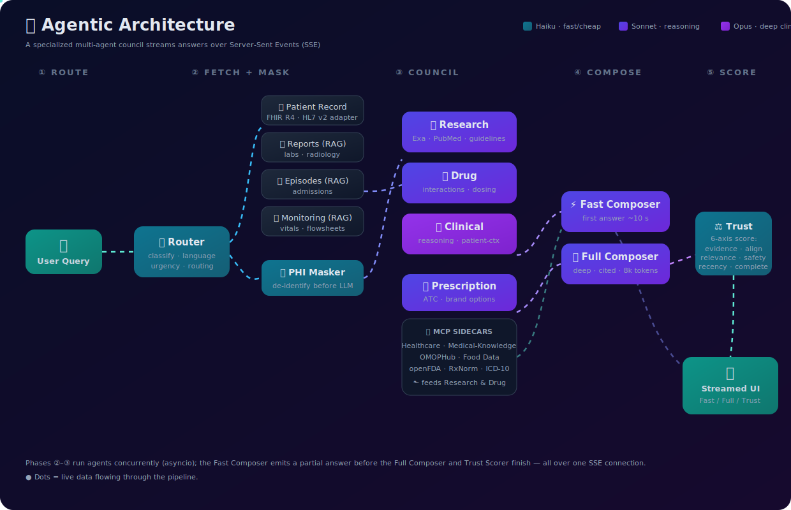
</div>

A clinical question flows through five phases. Agents within a phase run
concurrently.

```
1. ROUTE        Router (Haiku): classify intent, language, urgency; choose agents
2. FETCH+MASK   EHR adapter pulls the record; regex PHI masking de-identifies it
3. COUNCIL      Research / Drug / Clinical / Prescription run in parallel
4. COMPOSE      Fast Composer (streams first) then Full Composer (deep, cited)
5. SCORE        Trust agent scores six axes
```

<details open>
<summary><b>Agent roster</b></summary>

<br/>

| Agent | Model | Role |
|-------|-------|------|
| Router | Haiku | Classifies the query and picks which agents run |
| PHI de-identification | regex (no LLM) | Strips IDs, phones, emails, DOB, plates, protocol numbers on ingest |
| Research | Sonnet | Latest guidelines and literature (Exa + MCP) |
| Drug | Sonnet | Interactions, contraindications, dosing |
| Clinical | Opus | Reasoning grounded in patient context |
| Prescription | Sonnet | ATC mapping and per-country brand options |
| Episodes | Sonnet | Reasons over admission/episode RAG |
| Monitoring | Sonnet | Reasons over vitals/flowsheet RAG |
| Reports | Sonnet | Reasons over lab/radiology/pathology RAG; generates the patient brief |
| Fast Composer | Sonnet | The partial answer (`max_tokens=3072`) |
| Full Composer | Sonnet | The full, cited answer (`max_tokens=8192`) |
| Trust Scorer | Haiku | Six-axis confidence scoring |
| Decision Tree | Opus | Builds the visual reasoning tree (React Flow JSON) |

Model tiers are per-agent and configurable via environment variables; see
[Configuration](#configuration). Defaults: Haiku `claude-haiku-4-5-20251001`,
Sonnet `claude-sonnet-4-6`, Opus `claude-opus-4-6`.

</details>

> [!NOTE]
> Council agents are launched with `asyncio.create_task` and collected with
> `asyncio.as_completed`. Each is wrapped in a 90 s `asyncio.wait_for`; underneath,
> each Anthropic call has a 120 s timeout and Exa search times out at 15 s. A slow
> agent never blocks the others.

Deep dive: [`docs/ARCHITECTURE.md`](./docs/ARCHITECTURE.md).

## Clinical Reasoning Tree

A dedicated Decision Tree agent (Opus) derives the recommendation as an explicit
branch graph, returned in the `decision_tree` field and rendered as an interactive
React Flow diagram in the UI. Branches and thresholds are produced per query, not
hard-coded.

<div align="center">
</div>

## The Streaming Pipeline

<div align="center">
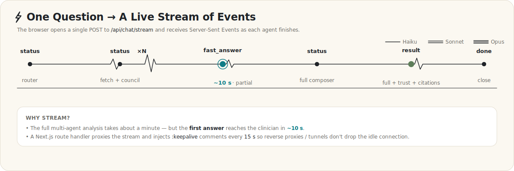
</div>

The browser opens one `POST /api/chat/stream` and receives Server-Sent Events as
each agent finishes. Each frame is `event: <name>\ndata: <json>\n\n`.

| Event | When | Payload |
|-------|------|---------|
| `status` | continuously | `{agent, status, message, phase, time_ms, tokens}` |
| `fast_answer` | after the Fast Composer | partial answer + early citations + `prescription_data` |
| `result` | on completion | the full `ChatResponse` (see [API Contract](#api-contract)) |
| `error` | on failure | `{message}` — the orchestrator raised; the UI surfaces it and stops |
| `done` | end | stream close |

A Next.js route handler proxies the stream and injects `:keepalive` comment lines
every 15 s (well inside Cloudflare's ~100 s idle timeout). The proxy aborts after
5 minutes (`AbortController` + route `maxDuration = 300`; `next.config.js` sets
`experimental.proxyTimeout` to 300000 ms).

## Trust & Confidence Scoring

A separate Trust agent scores every answer on six axes (each 0–100). Scores and a
one-line rationale per axis are returned in `trust_scores` / `trust_reasons`.

<div align="center">
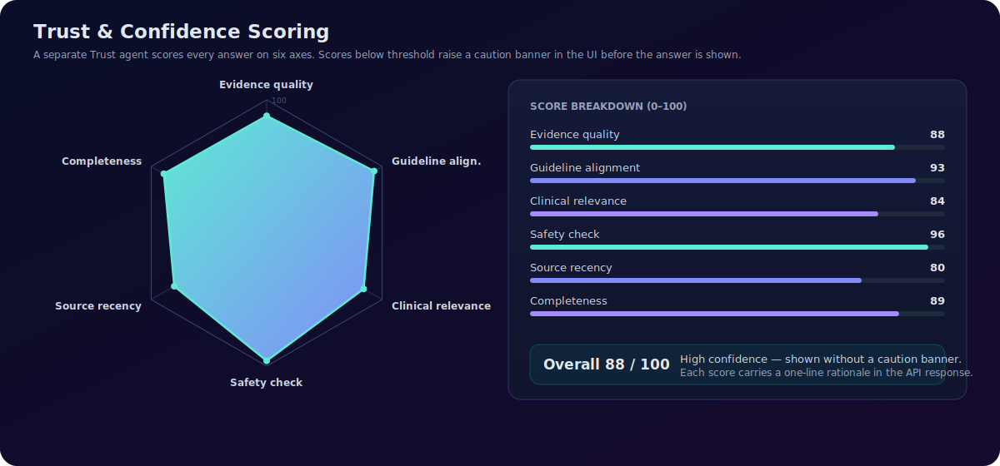
</div>

> [!CAUTION]
> Trust scores are **LLM-generated confidence heuristics**, not externally
> validated reliability measures. Treat them as hints, not guarantees.

<details>
<summary>How the scores are produced</summary>

<br/>

A single Trust agent (Haiku, `max_tokens=1024`, `temperature=0.1`) reads the
question, both answers, and the list of contributing agents, then returns one JSON
object: a 0–100 score and a one-line rationale per axis, plus a self-reported
`scorer_confidence`. Each axis score is clamped to `[0, 100]`; any axis the model
omits or returns in an unexpected shape defaults to 0. A keyword pre-pass detects
patient-record questions and applies a data-retrieval rubric (so it does not
down-score for lacking external RCTs/guidelines). If the response fails to parse,
all axes fall back to 0 with `scorer_confidence = 0`. The scorer judges the
already-composed answer; it does not re-run the council, so it shares any upstream
errors.

</details>

## Anatomy of a Query

<div align="center">
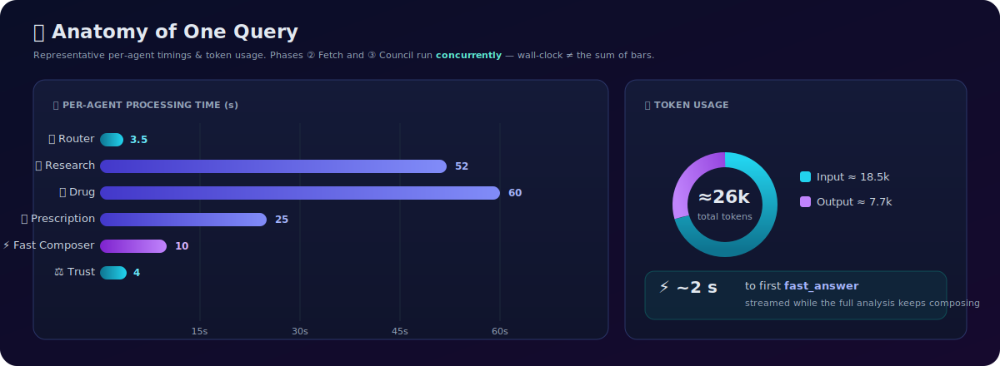
</div>

> [!NOTE]
> These numbers are **illustrative** — captured from one drug-dosing query, not a
> benchmark or an SLA. Timing and tokens vary with the question, the patient
> context size, and which agents the Router activates. Phases 2 and 3 run
> concurrently, so wall-clock time is much less than the sum of the bars.

## API Contract

```
POST /api/chat          → 200 application/json   (blocking; runs the whole pipeline)
POST /api/chat/stream   → 200 text/event-stream  (status / fast_answer / result / error / done)
```

Request body (both endpoints):

```jsonc
{ "message": "string", "session_id": "string | null" }
```

<details>
<summary><b>ChatResponse fields</b> (the <code>result</code> frame payload)</summary>

<br/>

| Field | Type | Notes |
|-------|------|-------|
| `session_id` | string | conversation/session id |
| `fast_answer` | string | partial answer (markdown) |
| `complete_answer` | string | full answer (markdown) |
| `trust_scores` | object | six ints 0–100: `evidence_quality`, `guideline_alignment`, `clinical_relevance`, `safety_check`, `completeness`, `source_recency` |
| `trust_reasons` | object | one-line rationale per axis |
| `scorer_confidence` | number | scorer self-confidence |
| `guidelines_used` | array | `{title, source, country, year, url}` |
| `citations` | array | `{index, title, source, country, year, url, quote, importance, effect_size, evidence_level}` |
| `prescription_data` | object | `{prescription, brand_options[], country}` |
| `decision_tree` | object | `{title, nodes[], edges[]}` (React Flow) |
| `agents_used` / `agent_timings` | array | which agents ran and their timings/tokens |
| `total_time_ms` / `total_input_tokens` / `total_output_tokens` | number | run totals |
| `language` / `priority_country` | string | detected query language / formulary country |
| `patient_context` | object \| null | PHI-masked patient dict echoed back when an identifier resolved (drives the banner, graph, trends); null otherwise |
| `izlem_brief_pdf` | string \| null | server path to a generated monitoring PDF brief, when one was produced |

</details>

Beyond chat, the backend exposes patient-data, RAG, transcription, reader, and
graph routes.

<details>
<summary>Other endpoints</summary>

```
GET  /health                                   liveness: {status, service}
POST /api/patient/ingest                       ingest + PHI-mask a patient from cookies JSON
POST /api/patient/clear                        clear the session's patient context
GET  /api/session/{id}[/messages]             session info / conversation history
POST /api/transcribe                           voice to text (needs GROQ_API_KEY or OPENAI_API_KEY)
POST /api/reports/fetch/{pid}                  fetch + index a patient's reports
GET  /api/reports/{pid}/manifest|trends|brief  reports manifest / lab trends / brief
POST /api/reports/{pid}/search                 RAG over reports
GET  /api/reader?url=...                        reader-mode content extraction for a link
POST /api/episodes/fetch/{pid}                 fetch + index admission episodes
GET  /api/episodes/{pid}/manifest|summary      episodes manifest / summary
POST /api/izlem/{pid}/brief                     generate a monitoring PDF brief
GET  /api/graph/{pid}/patient|reports|full     Neo4j knowledge-graph views
```
</details>

**Errors.** JSON endpoints return standard HTTP status codes via FastAPI: 400 (bad
request), 403 (path traversal on file routes), 404 (no data / missing file), 413
(audio over 25 MB), 500 (PDF/PACS generation), 502 (upstream EHR/MCP failure). The
stream surfaces failures as an `error` event, then closes.

## Animated Assets

Two formats: **animated SVGs** (`docs/assets/*.svg`) that render directly on GitHub
via CSS keyframes + SMIL, and **Lottie JSON** (`docs/assets/lottie/*.json`) for
richer animation inside the running app.

| SVG | Shows |
|-----|-------|
| `hero.svg` | Wordmark with a flowing neural network |
| `architecture.svg` | The agent council with signal dots traveling the pipeline |
| `decision-tree.svg` | The clinical reasoning tree |
| `pipeline.svg` | The SSE event timeline |
| `trust-gauge.svg` | The six-axis trust radar |
| `metrics.svg` | Per-agent latency bars and a token donut |
| `roadmap-board.svg` | The roadmap kanban board |

Essential content is drawn at rest; animation is only an enhancement (so the
images are correct even in static or cached renders).

<details>
<summary>Embed Lottie (HTML or React)</summary>

```html
<script src="https://unpkg.com/@lottiefiles/lottie-player@latest/dist/lottie-player.js"></script>
<lottie-player src="docs/assets/lottie/neural-pulse.json" loop autoplay
  background="transparent" style="width:240px;height:240px"></lottie-player>
```
```tsx
import Lottie from "lottie-react";
import data from "../../../docs/assets/lottie/neural-pulse.json";
export const ThinkingLoader = () => <Lottie animationData={data} loop autoplay style={{width:120,height:120}} />;
```
Lottie colors are RGBA 0–1 arrays per layer (`c`); SVG colors are gradient stops in
`<defs>`. Both edit in any text editor.
</details>

## How to Set Up

Four steps, plus image build time.

**Prerequisites**

| Need | Why | Get it |
|------|-----|--------|
| Docker + Compose | Runs the whole stack | [docker.com](https://www.docker.com/products/docker-desktop/) |
| Anthropic API key | Agent reasoning (required) | [console.anthropic.com](https://console.anthropic.com/) |
| Exa API key | Guideline search (recommended) | [exa.ai](https://exa.ai/) |

**Steps**

```bash
# 1. Clone
git clone https://github.com/ArioMoniri/cerebralink.git && cd cerebralink

# 2. Configure — copy the template, then add your keys
cp .env.example .env
#    edit .env → ANTHROPIC_API_KEY=sk-ant-...   (EXA_API_KEY=... recommended)

# 3. Launch the stack (frontend + backend + Redis + Neo4j + MCP sidecars)
docker compose up -d --build

# 4. Open the app
open http://localhost:3100
```

> [!NOTE]
> On first boot the MCP sidecars `npm install` their packages and can take a
> couple of minutes to report healthy. Watch with `docker compose ps`.

<details>
<summary>Verify it's working (Docker)</summary>

```bash
docker compose ps                                   # services → healthy
curl -s localhost:8100/health                       # {"status":"ok","service":"cerebralink"}
curl -s localhost:3100/api/chat \
  -H 'Content-Type: application/json' \
  -d '{"message":"DEMO what is the adult dose of paracetamol?"}' | head -c 200
```
The `DEMO` id loads the synthetic `examples/patient_DEMO.json` via the default file
adapter, so you can exercise the patient path with no EHR or credentials.
</details>

<details>
<summary>Run natively (without Docker)</summary>

```bash
# Infra first (the native config defaults to localhost Redis + Neo4j)
docker compose up -d redis neo4j

# Backend (host :8000)
python3.12 -m venv .venv && source .venv/bin/activate
pip install -r src/backend/requirements.txt
set -a; source .env; set +a                          # load .env (handles quoted values)
PYTHONPATH=. uvicorn src.backend.api.app:app --reload --port 8000
# verify: curl -s localhost:8000/health  → {"status":"ok","service":"cerebralink"}

# Frontend (new terminal, host :3100)
cd src/frontend && npm install
BACKEND_URL=http://localhost:8000 npm run dev        # http://localhost:3100 (next dev -p 3100)
```
</details>

<details>
<summary>Troubleshooting</summary>

| Symptom | Fix |
|---------|-----|
| A sidecar stays unhealthy for >3 min | Still `npm install`-ing — check `docker compose logs <service>` |
| `Backend connection failed` in the UI | `docker compose restart frontend` (re-resolves backend DNS after a rebuild) |
| Neo4j won't start | `docker compose restart neo4j` then `docker compose up -d` |
| Empty or 401 answers | Check `ANTHROPIC_API_KEY` in `.env`, then `docker compose up -d backend` |

</details>

## Configuration

Settings live in `.env` (template: `.env.example`) and resolve through
`src/backend/core/config.py`. The only required value is the API key.

```bash
ANTHROPIC_API_KEY=sk-ant-...         # required — agent reasoning
EXA_API_KEY=...                      # recommended — guideline search
```

> [!CAUTION]
> Never commit `.env`, cookies, or patient data. They are already git-ignored.

<details>
<summary>Full environment reference (model tiers, infra, MCP)</summary>

```bash
# Model tiers — override any agent's model
MODEL_ROUTER=claude-haiku-4-5-20251001
MODEL_CLINICAL=claude-opus-4-6        # Clinical and Decision Tree agents
MODEL_RESEARCH=claude-sonnet-4-6
MODEL_DRUG=claude-sonnet-4-6
MODEL_COMPOSER=claude-sonnet-4-6
MODEL_TRUST=claude-haiku-4-5-20251001
MODEL_BRIEFER=claude-sonnet-4-6      # Reports, Episodes, Monitoring (RAG briefers)
MODEL_PHI_MASKER=claude-haiku-4-5-20251001   # reserved; PHI masking is regex-only by default

# Optional
EHR_ADAPTER=file                     # file (default, synthetic/local JSON; runs on a fresh clone) | cerebral (Acıbadem scrapers, git-ignored)
GROQ_API_KEY=...                     # or OPENAI_API_KEY — enables voice transcription (/api/transcribe)
PATIENT_DATA_DIR=/app/patient_data   # where the file/cerebral adapter reads & caches patient JSON

# Infra (defaults work with docker-compose)
REDIS_URL=redis://redis:6379/0
NEO4J_URI=bolt://neo4j:7687
NEO4J_AUTH=neo4j/cerebralink2024

# MCP sidecars
HEALTHCARE_MCP_URL=http://healthcare-mcp:3002
MEDICAL_KNOWLEDGE_MCP_URL=http://medical-knowledge-mcp:3004
OMOPHUB_MCP_URL=http://omophub-mcp:3005
OMOPHUB_API_KEY=...
FDC_API_KEY=...                      # USDA FoodData Central (optional)
```

| Tier | Default | Agents |
|------|---------|--------|
| 1 | `claude-haiku-4-5-20251001` | Router, Trust, PHI Masker |
| 2 | `claude-sonnet-4-6` | Research, Drug, Composers, Prescription, Episodes, Monitoring, Reports |
| 3 | `claude-opus-4-6` | Clinical, Decision Tree |

All Tier-2 agents share the `claude-sonnet-4-6` default but resolve from different
variables: Research=`MODEL_RESEARCH`, Drug + Prescription=`MODEL_DRUG`,
Composers=`MODEL_COMPOSER`, Reports/Episodes/Monitoring=`MODEL_BRIEFER`.

</details>

## Data Sources & Retrieval

CerebraLink combines live APIs, MCP sidecars, file-based RAG, and a graph database.

| Source | Via | Provides |
|--------|-----|----------|
| Anthropic Claude | `agents/base.py` | All reasoning |
| Exa.ai | `tools/exa.py` | Country-aware guideline search |
| Healthcare MCP | sidecar `:3102` | openFDA, PubMed, ClinicalTrials.gov, ICD-10, medRxiv |
| Medical-Knowledge MCP | sidecar `:3104` | FDA, WHO, RxNorm, Google Scholar, pediatric |
| OMOPHub MCP | sidecar `:3105` | OMOP CDM terminology (SNOMED, ICD-10, RxNorm, LOINC) |
| Food Data MCP | sidecar `:3103` | USDA nutrition (optional) |
| Reports RAG | `tools/reports_rag.py` | Lab/radiology/pathology retrieval |
| Episodes RAG | `tools/episodes_rag.py` | Admission/discharge retrieval |
| Monitoring RAG | `tools/izlem_rag.py` | Vitals/flowsheet retrieval |
| Neo4j graph | `tools/graph.py` | Patient ↔ report ↔ episode ↔ drug relations |

Ports shown are host-published (e.g. `localhost:3102`); inside the Compose network,
services reach each other on the container port via the `*_MCP_URL` env vars (e.g.
`http://healthcare-mcp:3002`). A legacy general drug sidecar also runs at host `:3101`.

Documents are chunked with paragraph/sentence-aware splitting and entity
extraction (labs, dates, ICD codes). Lab text is parsed by `tools/lab_parser.py`
into structured values across horizontal, vertical, and serology layouts. Source
links can be opened through a reader proxy (`/api/reader`) that fetches a page and
extracts its main content.

## EHR Integration

CerebraLink talks to your EHR through a single pluggable adapter: one async
function that returns a normalized patient dict. PHI masking, RAG, the graph, and
all agents are EHR-agnostic. Because every EHR is reached through that one adapter,
the system is FHIR R4 and HL7 v2 compatible — you map your source's resources or
segments to the normalized patient dict once, and the rest works unchanged.

The active adapter is selected by the `EHR_ADAPTER` env var:

| `EHR_ADAPTER` | Module | Runs on a fresh clone? |
|---------------|--------|------------------------|
| `file` *(default)* | `tools/file_adapter.py` | **Yes** — reads synthetic JSON; ships with `examples/patient_DEMO.json` |
| `cerebral` | `tools/cerebral.py` | **No** — Acıbadem CerebralPlus; requires the git-ignored `scripts/cerebral_*.py` scrapers |

> [!IMPORTANT]
> Out of the box you get the **file adapter** with a synthetic demo patient — query
> the id `DEMO` (or drop your own synthetic `patient_<id>.json` into `patient_data/`).
> The `cerebral` adapter is opt-in and **does not run on a fresh clone**: its
> Acıbadem scraper scripts (`scripts/cerebral_*.py`), cookies, and the drug database
> are git-ignored and not distributed.

```python
# The entire contract (implemented by file_adapter.py and cerebral.py):
async def auto_fetch_patient(protocol_id: str) -> dict[str, Any]:
    """Resolve an identifier to a normalized patient dict
       ({patient, episodes[], reports[], ...})."""
```

The adapter guide covers the default file adapter, a **FHIR R4 code example** and a
CSV example you copy in, auth patterns (OAuth, session cookie, mTLS, VPN), and how
lab parsing works: [`docs/EHR_ADAPTER.md`](./docs/EHR_ADAPTER.md).

## Standards & Interoperability

| Standard | Status | Where |
|----------|--------|-------|
| Local file / CSV | **Shipped default** — runnable file adapter + synthetic `patient_DEMO.json` | `tools/file_adapter.py`, `examples/` |
| FHIR R4 | Documented code example (Patient, Encounter, DiagnosticReport) you copy in | [`docs/EHR_ADAPTER.md`](./docs/EHR_ADAPTER.md) |
| HL7 v2 | Adapter pattern — map PID / PV1 / OBX segments into the patient dict | [`docs/EHR_ADAPTER.md`](./docs/EHR_ADAPTER.md) |
| SNOMED CT, ICD-10, RxNorm, LOINC | Looked up through the OMOPHub MCP sidecar (subject to OMOPHub terms) | `tools/omophub_mcp.py` |
| OMOP CDM | Terminology/vocabulary mapping via OMOPHub | `tools/omophub_mcp.py` |
| ATC + brand mapping | Generic→brand options; the bundled Turkish drug database (`ilac.json`) is kept local and not distributed | `agents/prescription.py` |

Compatibility means the integration *surface* exists (one adapter + terminology
MCP). You supply credentials/endpoints and map your source's resources or segments;
licensing of the terminologies themselves is your responsibility.

## Project Structure

<details>
<summary>Repository tree</summary>

```
cerebralink/
├── src/
│   ├── backend/             # FastAPI + the agent council (Python 3.12)
│   │   ├── api/             # app, routes, schemas
│   │   ├── agents/          # router, research, drug, clinical, composer, trust, ...
│   │   ├── core/            # config, memory (Redis), orchestrator (SSE pipeline)
│   │   └── tools/           # exa, graph, lab_parser, *_mcp, *_rag, EHR adapter
│   └── frontend/            # Next.js 14 UI
│       └── src/
│           ├── app/         # chat shell + SSE proxy route handler
│           └── components/  # message bubble, trust gauges, graphs, trends, ...
├── docs/
│   ├── ARCHITECTURE.md      # deep architecture dive
│   ├── EHR_ADAPTER.md       # how to connect your EHR (FHIR R4 / HL7 v2)
│   └── assets/              # animated SVGs + Lottie JSON
├── scripts/                 # MCP bridge (EHR scrapers are kept local, git-ignored)
├── docker-compose.yml
├── Dockerfile.backend / .frontend / .medical-mcp
├── SECURITY.md  NOTICE  LICENSE  CONTRIBUTING.md  CODE_OF_CONDUCT.md
└── .env.example
```

</details>

## Tech Stack

**Backend** — FastAPI, uvicorn, Anthropic SDK, Pydantic, Redis, Neo4j, httpx,
PyMuPDF, BeautifulSoup, SSE-Starlette.

**Frontend** — Next.js 14, React 18, TypeScript, Tailwind, Framer Motion,
@xyflow/react (React Flow), Recharts, react-markdown, KaTeX.

**Infra** — Docker Compose, Model Context Protocol (MCP) sidecars, GitHub Actions
(build / import / compose-config checks).

## Status, Limitations & Known Gaps

This is an early-stage research project. Known limitations, stated plainly:

- **No automated test suite.** CI runs a frontend build + type-check, a backend
  import check, and `docker compose config` — not behavioral tests.
- **LLM outputs can be wrong or hallucinated** despite trust scores. Trust scores
  are model-generated heuristics, not validated reliability measures.
- **Performance figures are illustrative**, not benchmarked or guaranteed.
- **MCP sidecars install packages at runtime.** Pin and audit images before any
  sensitive deployment.
- **PHI masking is regex-based** (tuned for Turkish identifiers plus common
  international patterns). It is a safeguard, not a guarantee — review and extend
  it for your data.
- **FHIR R4 / HL7 v2 compatibility is via the adapter pattern.** A FHIR example
  ships; HL7 v2 requires you to map segments. Not certified against any profile.
- **Not validated for clinical use.** No trials, no regulatory clearance.

## Security

See [`SECURITY.md`](./SECURITY.md) for the vulnerability-reporting process
(private disclosure), scope (PHI handling, MCP sidecars, secrets, outbound
requests), and how to report clinical-safety issues (wrong dosing, dangerous
interactions, incorrect citations). Do not open public issues for security or
PHI-leak reports.

## Contributing

Contributions are welcome, from typo fixes to new agents and EHR adapters.

1. Read [`CONTRIBUTING.md`](./CONTRIBUTING.md) and [`CODE_OF_CONDUCT.md`](./CODE_OF_CONDUCT.md).
2. Fork and branch (`feat/...`, `fix/...`, `docs/...`).
3. Make sure CI passes: `tsc --noEmit`, backend imports, `docker compose config`.
4. Never commit real patient data — synthetic data only.
5. Open a PR with the checklist filled in.

Good first contributions: a new MCP data source, an EHR adapter (Epic, OpenEMR,
FHIR, HL7 v2), a lab-report parser for a new format or language, or UI/accessibility
work.

## Roadmap

<div align="center">
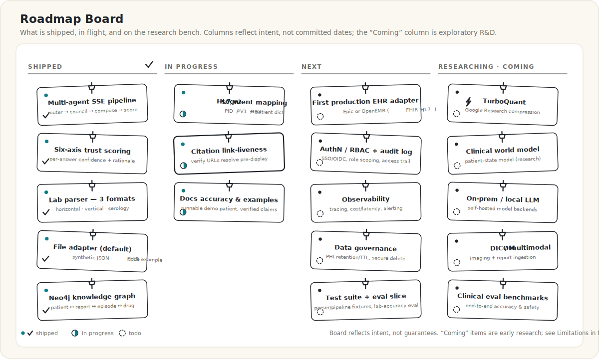
</div>

The board reflects intent, not delivery dates. The **Researching / Coming** column
is early-stage R&D — see [Limitations](#status-limitations--known-gaps).

| Shipped | In Progress | Next | Researching · Coming |
|---------|-------------|------|----------------------|
| Multi-agent SSE pipeline | HL7 v2 segment mapping | First production EHR adapter (Epic/OpenEMR) | **TurboQuant** (codename) — quantized serving (INT8/4-bit) |
| Six-axis trust scoring | Citation link-liveness checking | AuthN / RBAC + audit logging | **Clinical world model** (research) — patient-state model to inform routing |
| Lab parser (3 formats) | Docs accuracy & runnable demo patient | Observability (tracing, cost/latency) | On-prem / local LLM backends |
| File adapter (default) + FHIR code example | | Data governance (PHI retention/TTL, secure delete) | DICOM / multimodal ingestion |
| Neo4j knowledge graph | | Test suite + lab-accuracy eval slice | Clinical eval benchmarks |

> The **Researching · Coming** column is exploratory research, not committed work or
> dated promises. Also under consideration (not yet on the board): cost & latency controls (prompt caching,
> token budgets, adaptive model routing), UI internationalization, and configurable
> trust rubrics.

## License

Apache License 2.0, © 2026 Ariorad Moniri. See [`NOTICE`](./NOTICE) for attribution,
third-party data-source terms, and the medical disclaimer.

<div align="center">
<sub>Built by <a href="https://github.com/ArioMoniri">Ariorad Moniri</a> and contributors.</sub>
</div>
